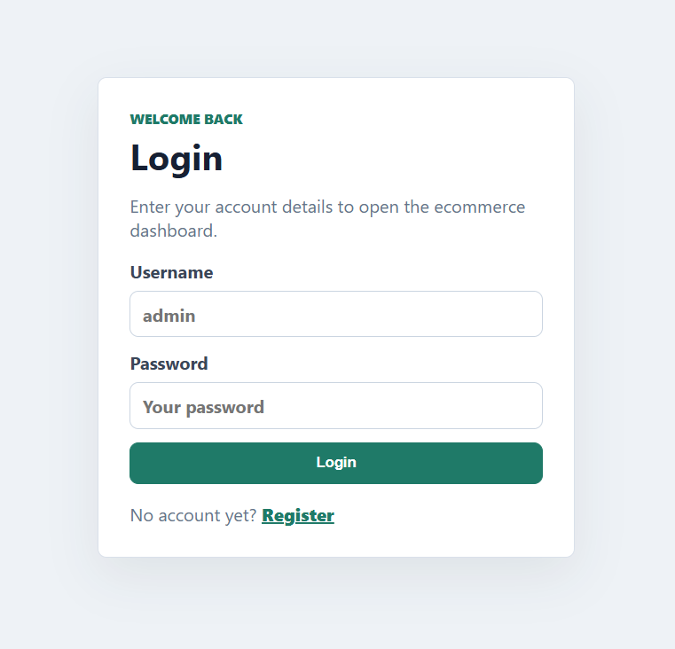
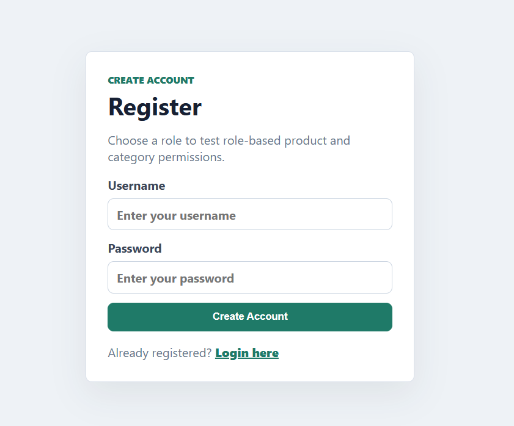
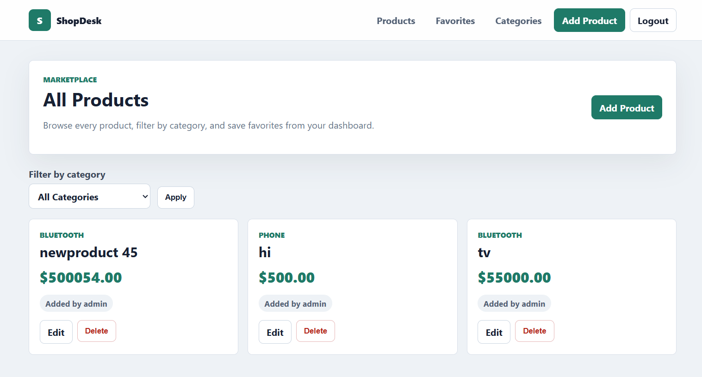
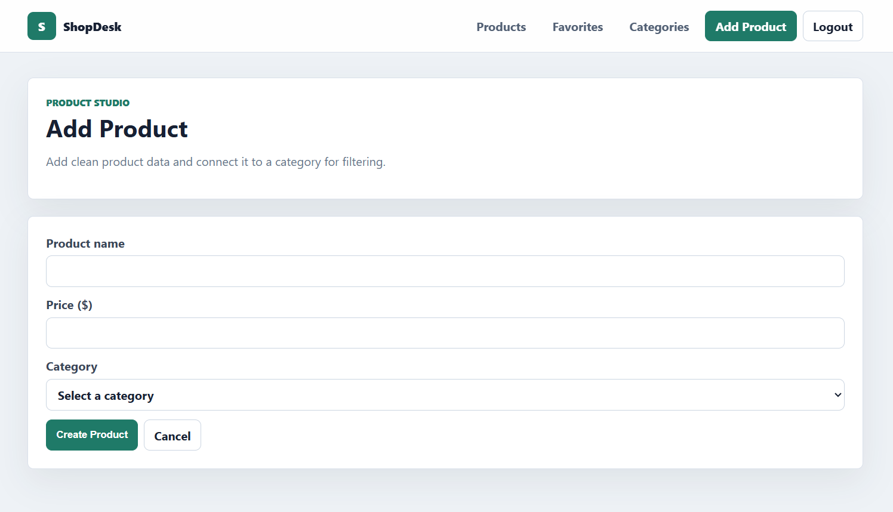
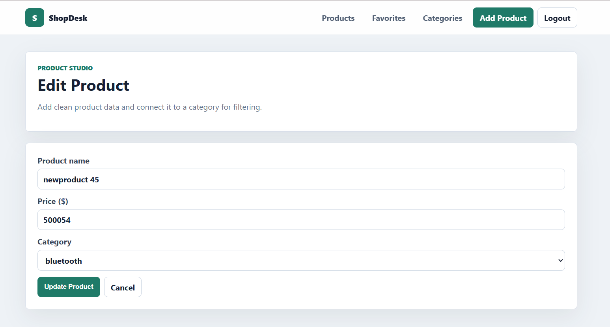
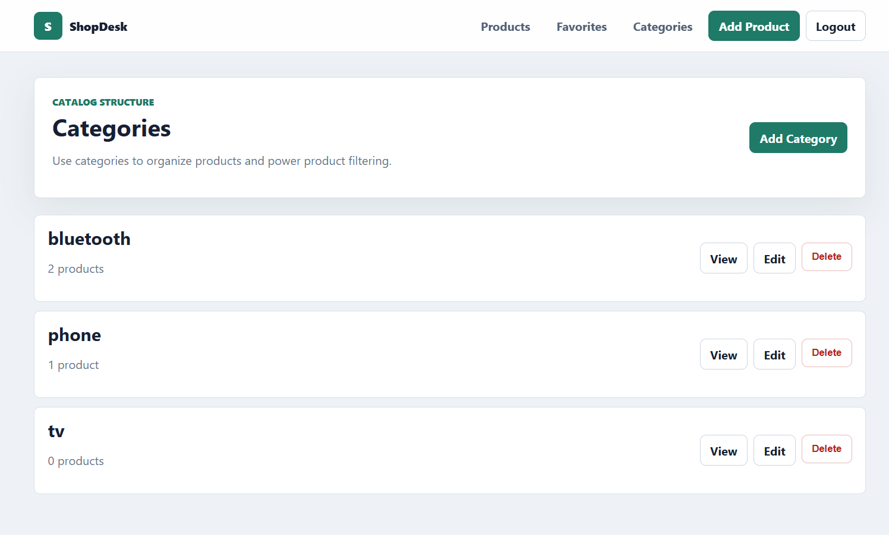

# 🛒 E-Commerce Platform (Node.js + Express + MongoDB + JWT Authentication)

A complete E-Commerce Platform built using **Node.js, Express.js, MongoDB, Mongoose, JWT Authentication, Cookies, Role-Based Access Control, MVC Architecture, EJS Templates, and Multi-User Product Management**.

This project was developed as a **Node.js Practical Exam Project** and demonstrates authentication, authorization, CRUD operations, category management, user-specific product handling, and responsive navigation.

---

## 📌 Features

### 🔐 Authentication & Authorization

* User Registration
* User Login
* JWT Token Authentication
* Cookie-Based Session Management
* Password Hashing
* User Logout
* Protected Routes
* Role-Based Access Control (Admin/User)

### 👥 Multi User Support

* Multiple users can register and login
* Each user can manage their own products
* User-specific product listing
* Product ownership tracking

### 📦 Product Management

* Add Product
* View Products
* Update Product
* Delete Product
* Product Images Upload
* Product Category Assignment
* Populate Category Information

### 🏷 Category Management

* Add Category
* Edit Category
* Delete Category
* Category-wise Product Filtering

### 🎨 Frontend

* EJS Templating Engine
* Responsive Navbar
* Dynamic Product Listing
* User Dashboard
* Login/Register Pages

---

# 🛠 Technologies Used

| Technology    | Purpose          |
| ------------- | ---------------- |
| Node.js       | Backend Runtime  |
| Express.js    | Server Framework |
| MongoDB       | Database         |
| Mongoose      | ODM              |
| JWT           | Authentication   |
| Cookie Parser | Cookie Handling  |
| EJS           | View Engine      |
| Multer        | Image Upload     |
| BCryptJS      | Password Hashing |
| CSS           | Styling          |

---

# 📂 Project Structure

```bash
NODE/
│
├── assets/
│   └── images/
│       ├── Add-product.png
│       ├── Categories.png
│       ├── Edit-product.png
│       ├── Favorites.png
│       ├── Login.png
│       ├── Product.png
│       └── Register.png
│
├── config/
│   └── db.js
│
├── controllers/
│   ├── authController.js
│   ├── categoryController.js
│   └── productController.js
│
├── middleware/
│   └── authMiddleware.js
│
├── models/
│   ├── User.js
│   ├── Product.js
│   └── Category.js
│
├── public/
│   └── css/
│       └── style.css
│
├── routes/
│   ├── userRoutes.js
│   ├── productRoutes.js
│   └── categoryRoutes.js
│
├── views/
│   ├── login.ejs
│   ├── register.ejs
│   ├── navbar.ejs
│   ├── productList.ejs
│   ├── productForm.ejs
│   ├── productItem.ejs
│   ├── myProducts.ejs
│   └── categoryList.ejs
│
├── package.json
├── package-lock.json
└── index.js
```

---

# ⚙ Installation

### Clone Repository

```bash
git clone <repository-url>
```

### Navigate to Project

```bash
cd NODE
```

### Install Dependencies

```bash
npm install
```

### Create Environment Variables

Create a `.env` file:

```env
PORT=5000

MONGO_URI=mongodb://127.0.0.1:27017/ecommerce

JWT_SECRET=your_secret_key
```

### Start Server

```bash
npm start
```

or

```bash
nodemon index.js
```

# 🛡 Protected Routes

| Route                | Access             |
| -------------------- | ------------------ |
| /products            | Authenticated User |
| /products/add        | Authenticated User |
| /products/edit/:id   | Owner/Admin        |
| /products/delete/:id | Owner/Admin        |
| /categories          | Admin              |
| /categories/add      | Admin              |

---

# 📸 Project Screenshots

## 🔑 Login Page



---

## 📝 Register Page



---

## 📦 Product List



---

## ➕ Add Product



---

## ✏ Edit Product



---

## 🏷 Category Management



---

## ❤️ Favorites / My Products


---

# 🚀 MVC Architecture Used

### Model

Handles database structure.

```bash
models/
```

### View

Handles frontend rendering.

```bash
views/
```

### Controller

Handles business logic.

```bash
controllers/
```

---

# 📋 Future Enhancements

* Search Products
* Product Reviews
* Shopping Cart
* Wishlist
* Payment Gateway Integration
* Admin Dashboard Analytics
* Order Management System

---

# 👨‍💻 Developed For

**Node.js Practical Examination Project**

### Evaluation Coverage

✅ MongoDB Models
✅ JWT Authentication
✅ Cookie Parser
✅ MVC Pattern
✅ Multi User Support
✅ Role Based Access Control
✅ Product CRUD
✅ Category CRUD
✅ Populate Method
✅ Protected Routes
✅ Navbar Navigation
✅ EJS Views
✅ Responsive UI

---

# 📄 License

This project is created for educational and practical examination purposes. Free to use and modify.

---

## ⭐ Author

Raid Maniyar

